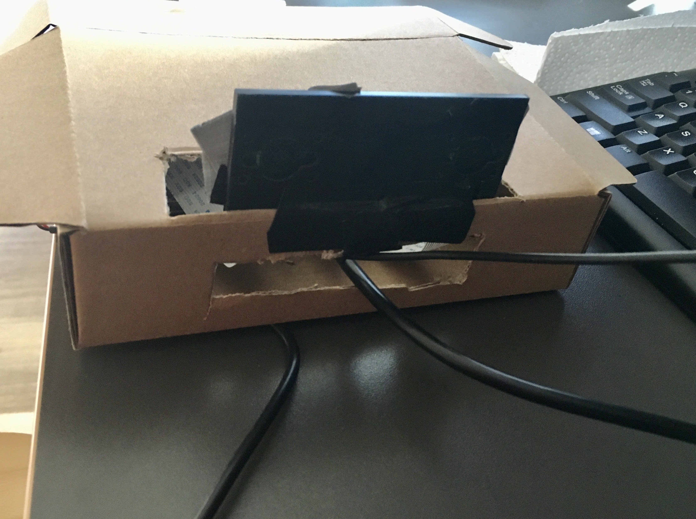

# Master Thesis (Jacobs University Bremen)
## A Stereo SLAM Pipeline For Dense 3D Reconstruction




### Description
The aim of this thesis is to build a large scale 3D reconstruction pipeline, with applications for realtime 3D mapping.

The project contains 4 essential components:

1. A *stereo streamer*: this will be developed as a ROS component that streams stereo images, as well as IMU data.

2. *3D Reconstruction Server*: A server that will accept the stereo stream from the *stereo streamer* and reconstruct point clouds in **real-time** using SLAM techniques.

3. *Networking Protocol*: The networking protocol built using C++14, and Boost.Asio as an independant library to connect all 3 components outlined above together.

### Prerequisites

The following dependancies are required:

```
1. Boost 1.66+
2. OpenCV 4.0+ (SfM contrib module included)
3. PCL 1.8+
4. Eigen 3.3+
5. G2o Framework
```

### Installing

Clone the repository:

```
git clone https://github.com/asadahmedde/master-thesis.git
```

Build the project files:

```
cd master-thesis
mkdir build && cd build
cmake ..
make
```

Copy the sample config file into the build folder:

```
cp ../cv_reconstruct/resources/config_default.json config.json
```

### Running the server

To run the server, run the cv_server target executable in the build folder. Customise the config.json file to tune parameters as required before running the server.
```
cp ../cv_reconstruct/resources/config_default.json config.json
```

Now run the server:
```
./cv_server
```
